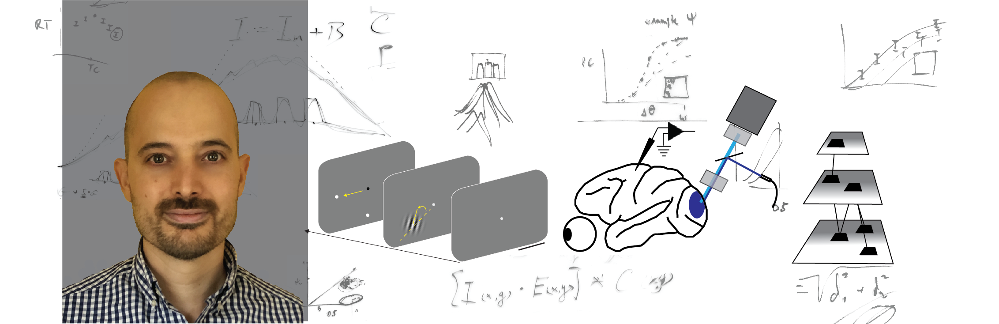

<!-- tabs:start -->
#### **About me**
I am a Research Associate in the laboratory of [Eyal Seidemann](https://cns.utexas.edu/directory/item/409-seidemann-eyal?Itemid=349) at the [Center for Perceptual Systems](https://liberalarts.utexas.edu/cps/) (University of Texas). I earned my PhD in Neuroscience at the French National Centre for Scientific Research (CNRS) of Marseille ([INT](http://www.int.univ-amu.fr/)).

I am interested in the neural mechanisms underlying visual cognition and in the development of visual prosthetics to restore vision in blind patients.

I am currently investigating the role of functional maps in the cortex in integrating and encoding visual information.

<!-- tabs:end -->
