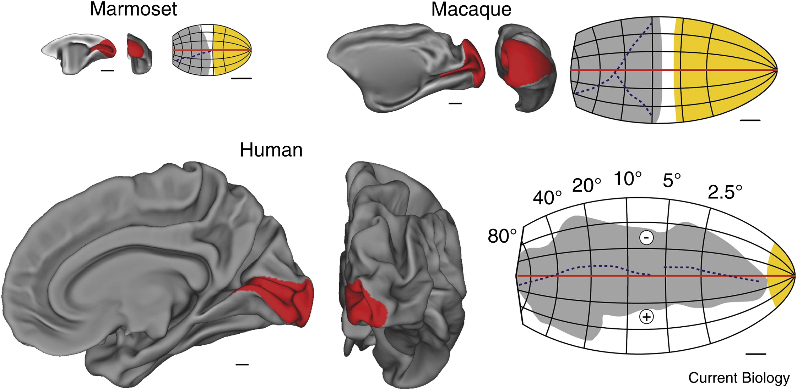

# Retinotopy Model

## Background
### Retinotopic maps in V1 of different species

 *Each panel shows medial (left) and posterior (center) views of partially ‘inflated’ right hemispheres of the brains of the three species, based on MRI reconstructions of the middle layers of the cortex. The location of area V1 is indicated in red. On the right are two-dimensional models of the retinotopic organization of V1, fitted to high-resolution data. The grey region indicates the part of V1 that is buried within the calcarine sulcus, and the yellow region indicates the part that is exposed on the surface of the occipital lobe (white indicates regions that are exposed on the mesial surface of the brain). Corresponding landmarks are shown for macaque and marmoset monkey. Scale bars in all panels = 5 mm. [DOI:https://doi.org/10.1016/j.cub.2012.11.003](https://doi.org/10.1016/j.cub.2012.11.003)*

## Retinotopic Model
[Retinotopic Model repo](https://github.com/giacomox/RetinoMapModel)

Prerequisites
* I am using a bayesian minimization alghoritm to fit the measured retinotopy and the model. You can download this free (and cool) library here ([BADS](https://github.com/lacerbi/bads)).
